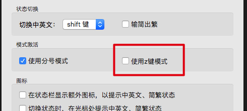

清歌输入法 之 小鹤音形词库
======================

根据清歌输入法的词库规则，生成了小鹤双拼（音形）的词库，这样就可以在清歌输入法使用小鹤了。

为什么要在一个五笔输入法中使用双拼？
------------------

因为其它的双拼输入法我都试过了，都有不符合我心意的理由：

- 落格输入法（付费购买）：词库管理功能太弱，加词删词太不方便。对于一个需要精心维护词库的双拼加辅助码用户来说，这个问题是致命的，也是导致我放弃落格的原因
- Rime：修改配置实在太麻烦，自己忍忍也就算了，可是还要教家人用呢
- 其它：好像都不支持自定义码表

最后惊喜的发现自己用的最顺手的清歌五笔输入法可以自定义词库（码表），于是按照格式生成了相应的词库，居然成功了，非常开心。

清歌输入法有几个特别合我心意的功能：

- 快速加词：`ctrl + shift + 加号`，且自动根据反查表，生成提示编码（对于拼音，由于重音字的存在，有时不准，不过多数时候还是可用）
- 快速删词：`ctrl + shift + 序号`
- 词语提前：`ctrl + 序号`
- 临时全拼：<code>`</code>，并且提示编码

特别是前三个跟词库相关的功能，实在太需要了。

如何使用本词库
-------

将`data/generated`目录下的两个文件导入到清歌输入法：

- `xiaohe_table`: 小鹤音形码表
- `xiaohe_reverse_table`：小鹤反差码表

同时，一定记得禁用清歌的`z`模式，才能正常使用：

注意
---

我收集到的小鹤编码可能不够全，且可能存在错误。如果你发现了，欢迎来提Issue。

